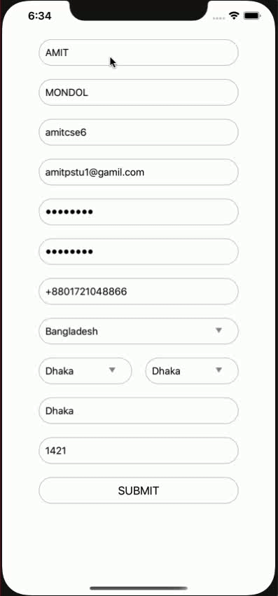

# ASForm

[](https://travis-ci.org/amitpstu1@gmail.com/ASForm)
[](https://cocoapods.org/pods/ASForm)
[](https://cocoapods.org/pods/ASForm)
[](https://cocoapods.org/pods/ASForm)

Screenshots
---------


## Example

To run the example project, clone the repo, and run `pod install` from the Example directory first.

## Requirements

## Installation

ASForm is available through [CocoaPods](https://cocoapods.org). To install
it, simply add the following line to your Podfile:

```ruby
pod 'ASForm'
```

## Author

amitpstu1@gmail.com, amitpstu1@gmail.com

## License

ASForm is available under the MIT license. See the LICENSE file for more info.
